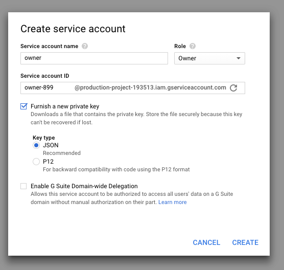

# Setup Exekube with Google Cloud and GKE

## Requirements starting from zero

- For Linux users, [Docker CE](/) and [Docker Compose](/) are sufficient
- For macOS users, [Docker for Mac](/) is sufficient
- For Windows users, [Docker for Windows](/) is sufficient

## Step-by-step instructions

1. Clone the git repo with default configuration values:

    ```bash
    git clone https://github.com/ilyasotkov/exekube \
    && cd exekube
    ```

2. Create an alias for your shell session (`xk` stands for "exekube"):

    ```bash
    alias xk=". .env && docker-compose run --rm exekube"
    ```

3. If you don't have one, create a [Google Account](https://console.cloud.google.com/). Then, create a new Google Cloud Platform [Project](https://console.cloud.google.com).

    | Project name | Project ID |
    | --- | --- |
    | Production Project | production-project-20180101 |

4. Rename `.env.example` file in repo root to `.env`. Set the `TF_VAR_gcp_project` variable to the value from previous step.

    ```bash
    mv .env.example .env
    ```

    ```diff
    export XK_LIVE_DIR='/exekube/live/prod'
    - export TF_VAR_gcp_project='my-project-186217'
    + export TF_VAR_gcp_project='prod-env-20180101'
    export TF_VAR_gcp_remote_state_bucket='project-terraform-state'
    ```

5. [Create a service account](https://console.cloud.google.com/projectselector/iam-admin/serviceaccounts) and give it project owner permissions. Download the account JSON private key file to repo root directory and rename the file to `credentials.json`.

    

6. Run this command authenticate us to `gcloud`:

    ```bash
    xk gcloud auth activate-service-account --key-file live/prod/owner-key.json
    ```

7. Finally, create a Google Cloud Storage bucket (with versioning) for our Terraform remote state:

    ```bash
    xk gsutil mb \
            -p ${TF_VAR_gcp_project} \
            gs://${TF_VAR_gcp_remote_state_bucket} \
    && xk gsutil versioning set on \
            gs://${TF_VAR_gcp_remote_state_bucket}
    ```
